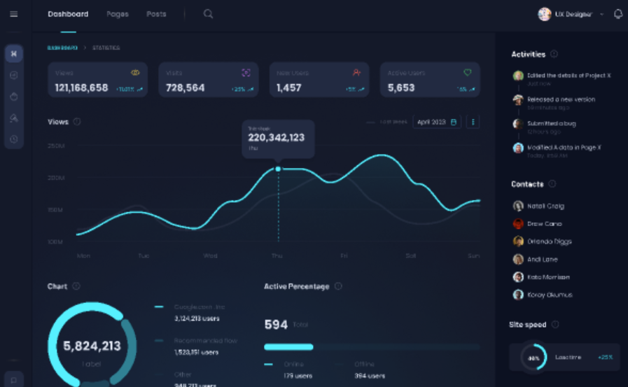

# Contruccion de backend 

Contexto general

Backend para un despacho de abogados tipo “mini-CRM legal + portal de cliente + landing”. Debe permitir:
	1.	Gestión interna (abogado/secretaria): clientes, casos, documentos, citas, notas.
	2.	Portal opcional para cliente: ver su caso, descargar documentos y enviar solicitudes.
	3.	Soporte a la web pública: servicios, reseñas, casos de éxito, formulario de contacto.

Arquitectura: Django + DRF. Apps: users, clients, cases, documents, appointments, landing.

⸻

Roles y permisos (se resuelven en User)

El control de acceso se hace con User.role (modelo ya definido del otro proyecto) y is_staff:
	•	boss: abogado/admin (control total)
	•	employe: staff/secretaria (control parcial, sin acciones sensibles si se decide)
	•	client: cliente final (si se habilita portal)

Reglas base:
	•	Solo boss y employe acceden al panel interno.
	•	client solo accede a lo suyo (sus datos, sus casos, sus documentos, sus citas).
	•	Todo documento y nota debe tener visibilidad controlada (interno vs visible al cliente).

⸻

Entidades principales (modelo mental)

1) Client

Representa a la persona/cliente del despacho (datos reales del cliente).
Puede o no estar ligado a un User con role=client (para portal).

2) Case

Expediente / asunto legal. Núcleo del sistema.
Un Case pertenece a un Client.
Tiene tipo (civil/penal/laboral…), estado (abierto/en curso/cerrado), abogado asignado, fechas clave y notas internas.

3) Document

Archivo asociado a un caso (demanda, contrato, sentencia, etc.).
Cada Document pertenece a un Case.
Debe registrar: quién lo subió (staff o cliente), tipo de documento, fecha, y si el cliente puede verlo/descargarlo.

4) Appointment

Citas. Pueden estar asociadas a un Client y opcionalmente a un Case.
Tipos: presencial, llamada, videollamada.
Estados: pendiente, confirmada, cancelada, completada.
Debe permitir sincronización futura (Google Calendar/Meet) pero por ahora solo dejar el “hueco” (campos/metadatos).

5) Landing (contenido público)
	•	Service: servicios ofrecidos (título, descripción, CTA)
	•	Testimonial: reseñas (nombre, texto, rating, fecha)
	•	SuccessCase: casos de éxito (sin datos sensibles)
	•	ContactRequest: consultas entrantes del formulario

⸻

Cómo debe funcionar en la práctica (flujos)

Flujo A: Gestión interna (staff)
	1.	Crear/editar un cliente (Client)
	2.	Crear un caso para ese cliente (Case)
	3.	Subir documentos al caso (Document)
	4.	Programar citas (Appointment)
	5.	Registrar notas internas del caso y marcar si algo es visible para cliente o no
	6.	Dashboard básico: casos abiertos, citas próximas, documentos recientes, consultas nuevas

Flujo B: Portal de cliente (si se habilita)
	1.	Cliente inicia sesión (User.role=client)
	2.	Ve su perfil y sus datos básicos (sin acceso a otros)
	3.	Ve lista de sus casos y el detalle
	4.	Descarga solo documentos marcados como visibles
	5.	Puede subir documentos solicitados por el abogado (opcional)
	6.	Puede ver/solicitar citas (según regla)
	7.	Puede enviar mensajes/solicitudes (puede mapearse a ContactRequest o un módulo de mensajes futuro)

Flujo C: Landing pública (conversión)
	1.	Web muestra servicios, reseñas, casos de éxito
	2.	Formulario crea un ContactRequest
	3.	Staff recibe y lo convierte en cliente/caso cuando proceda

⸻

API: comportamiento esperado (alto nivel)
	•	Endpoints separados por acceso:
	•	Internos (boss/employe): CRUD completo de clients/cases/documents/appointments + gestión landing
	•	Cliente (client): acceso filtrado a “solo lo suyo” (cases/documents/appointments)
	•	Público: solo lectura de landing + creación de contact requests

Reglas críticas:
	•	Filtrado estricto por ownership (client solo ve sus casos)
	•	Documentos: control de visibilidad
	•	Auditoría mínima: created_by, updated_by, timestamps (para trazabilidad)

⸻

Estados y enums recomendados (concepto)
	•	Case.status: open, in_progress, closed
	•	Appointment.status: pending, confirmed, cancelled, done
	•	Appointment.type: in_person, phone, video
	•	Document.type: contract, claim, lawsuit, sentence, id, other (o similar)

⸻

Objetivo de calidad
	•	Backend limpio y escalable: cada app representa un concepto del negocio.
	•	Sin features raras de inicio: primero CRUD sólido, permisos correctos, filtros correctos.
	•	Preparado para integraciones futuras (calendar/meet, notificaciones, mensajería).


Modelo user :
```

"""User model module for authentication and authorization.

This module defines custom User and UserManager models extending Django's
AbstractUser to support role-based access control and additional user profile
information for the digital menu system.
"""

from typing import Optional
from django.db import models
from django.contrib.auth.models import AbstractUser, BaseUserManager
from django.utils import timezone
import secrets
from datetime import timedelta


class UserManager(BaseUserManager):
    """Custom user manager for creating users and superusers.

    Extends Django's BaseUserManager to handle custom user creation logic,
    including email normalization and role assignment for superusers.

    Methods:
        create_user: Creates and saves a regular user with the given credentials.
        create_superuser: Creates and saves a superuser with staff privileges.

    Note:
        - Email is required for user creation
        - Superusers are automatically assigned the 'boss' role
        - Passwords are properly hashed using set_password()
    """

    def create_user(
        self,
        username: str,
        email: str,
        name: str,
        password: Optional[str] = None
    ) -> 'User':
        """Create and save a regular user with the given credentials.

        Args:
            username: Unique username for authentication (max 50 chars).
            email: User's email address, will be normalized.
            name: User's full name or display name.
            password: Plain text password to be hashed. Defaults to None.

        Returns:
            User: The newly created user instance.

        Raises:
            ValueError: If email is not provided.

        Example:
            >>> user_manager = UserManager()
            >>> user = user_manager.create_user(
            ...     username='johndoe',
            ...     email='john@example.com',
            ...     name='John Doe',
            ...     password='securepass123'
            ... )
            >>> user.is_staff
            False
            >>> user.role
            'client'
        """
        if not email:
            raise ValueError("you need to provide an email")
        user = self.model(
            username=username, email=self.normalize_email(email), name=name
        )
        user.set_password(password)
        user.save()
        return user

    def create_superuser(
        self,
        username: str,
        email: str,
        name: str,
        password: str
    ) -> 'User':
        """Create and save a superuser with staff privileges and boss role.

        Args:
            username: Unique username for authentication (max 50 chars).
            email: User's email address, will be normalized.
            name: User's full name or display name.
            password: Plain text password to be hashed.

        Returns:
            User: The newly created superuser instance with staff privileges.

        Example:
            >>> user_manager = UserManager()
            >>> superuser = user_manager.create_superuser(
            ...     username='admin',
            ...     email='admin@example.com',
            ...     name='Admin User',
            ...     password='adminpass123'
            ... )
            >>> superuser.is_staff
            True
            >>> superuser.role
            'boss'
        """
        user = self.create_user(
            username=username,
            email=email,
            name=name,
            password=password,
        )

        user.is_staff = True
        user.role = 'boss'
        user.save()
        return user


class User(AbstractUser):
    """Custom user model with role-based access control and profile information.

    Extends Django's AbstractUser to add role-based permissions (client, boss, employee),
    profile information (address, phone, location), and avatar support. Used for
    authentication and authorization throughout the digital menu system.

    Attributes:
        objects (UserManager): Custom manager for user creation and management.
        username (str): Unique username for authentication (max 50 chars).
        name (str): User's full name or display name (max 100 chars).
        email (str): Unique email address for the user.
        image (ImageField): User avatar uploaded to 'avatar/' directory.
                           Defaults to 'avatar/default.jpg'.
        is_staff (bool): Whether user has staff/admin privileges. Defaults to False.
        role (str): User's role in the system. Choices: 'client', 'boss', 'employe'.
                   Defaults to 'client'.
        address (str): User's street address (max 250 chars, optional).
        location (str): User's city or locality (max 250 chars, optional).
        province (str): User's province or state (max 100 chars, optional).
        phone (str): User's phone number (max 20 chars, optional).

    Role Choices:
        - client: Regular customer with ordering permissions
        - boss: Manager/owner with full administrative access
        - employe: Staff member with limited administrative access

    Example:
        >>> # Create a regular client user
        >>> user = User.objects.create_user(
        ...     username='customer1',
        ...     email='customer@example.com',
        ...     name='Jane Customer',
        ...     password='securepass'
        ... )
        >>> user.role
        'client'
        >>> user.is_staff
        False
        >>>
        >>> # Create a superuser (boss)
        >>> boss = User.objects.create_superuser(
        ...     username='admin',
        ...     email='admin@example.com',
        ...     name='Admin User',
        ...     password='adminpass'
        ... )
        >>> boss.role
        'boss'
        >>> boss.is_staff
        True
        >>>
        >>> # Update user profile
        >>> user.address = '123 Main St'
        >>> user.phone = '+1234567890'
        >>> user.save()

    Note:
        - Username and email must be unique
        - Email is required for user creation
        - Default avatar is provided at 'avatar/default.jpg'
        - Table name preserved as 'users_users' for backward compatibility
        - All users have full permissions (has_perm returns True)
    """

    ROLE = (
        (
            "client",
            "client",
        ),
        (
            "boss",
            "boss",
        ),
        (
            "employe",
            "employe",
        ),
    )

    # Custom manager
    objects = UserManager()

    # Database fields
    username = models.CharField("Username", max_length=50, unique=True)
    name = models.CharField("Name", max_length=100)
    email = models.EmailField("Email", max_length=254, unique=True)
    image = models.ImageField(
        "Image", upload_to="avatar", null=True, blank=True, default="avatar/default.jpg"
    )
    # Permissions
    is_staff = models.BooleanField(default=False)
    role = models.CharField("Role", choices=ROLE, max_length=50, default="client")
    # Profile data
    address = models.CharField("Address", max_length=250, blank=True, null=True)
    location = models.CharField("Location", max_length=250, blank=True, null=True)
    province = models.CharField("Province", max_length=100, blank=True, null=True)
    phone = models.CharField("Phone", max_length=20, blank=True, null=True)

    class Meta:
        db_table = 'users_users'  # Keep the old table name to avoid migration issues

    def __str__(self) -> str:
        """Return string representation of the user.

        Returns the user's full name for display purposes.

        Returns:
            str: User's name.

        Example:
            >>> user = User.objects.get(username='johndoe')
            >>> str(user)
            'John Doe'
        """
        return self.name

    def has_perm(self, perm: str, obj: Optional[object] = None) -> bool:
        """Check if user has a specific permission.

        Currently returns True for all users, granting universal permissions.
        Can be customized to implement role-based permission checks.

        Args:
            perm: Permission string to check (e.g., 'app.add_model').
            obj: Optional object to check permission against. Defaults to None.

        Returns:
            bool: Always True in current implementation.

        Example:
            >>> user.has_perm('products.add_product')
            True
        """
        return True

    def has_module_perms(self, app_label: str) -> bool:
        """Check if user has permissions to access a specific app module.

        Currently returns True for all users and all modules. Can be customized
        to implement role-based module access control.

        Args:
            app_label: Django app label to check permissions for (e.g., 'products').

        Returns:
            bool: Always True in current implementation.

        Example:
            >>> user.has_module_perms('products')
            True
            >>> user.has_module_perms('admin')
            True
        """
        return True

    USERNAME_FIELD = "username"
    REQUIRED_FIELDS = ["email", "name"]


class PasswordResetToken(models.Model):
    """Model for managing password reset tokens.

    Stores temporary tokens used for password reset functionality. Tokens are
    randomly generated and expire after 1 hour for security purposes.

    Attributes:
        user (ForeignKey): Reference to the User requesting password reset.
        token (str): Random 64-character token for verification.
        created_at (datetime): Timestamp when token was created.
        expires_at (datetime): Expiration timestamp (1 hour after creation).
        used (bool): Whether the token has been used. Defaults to False.

    Example:
        >>> # Create password reset token
        >>> user = User.objects.get(email='user@example.com')
        >>> reset_token = PasswordResetToken.objects.create(user=user)
        >>> reset_token.token
        'abc123def456...'  # 64-character random token
        >>> reset_token.is_valid()
        True
        >>>
        >>> # Check if token is still valid
        >>> if reset_token.is_valid():
        ...     user.set_password('newpassword')
        ...     user.save()
        ...     reset_token.used = True
        ...     reset_token.save()

    Note:
        - Tokens expire 1 hour after creation
        - Tokens can only be used once (used=True after first use)
        - Old tokens should be cleaned up periodically
    """

    user = models.ForeignKey(
        User,
        on_delete=models.CASCADE,
        related_name='password_reset_tokens',
        verbose_name='User'
    )
    token = models.CharField('Token', max_length=64, unique=True)
    created_at = models.DateTimeField('Created At', auto_now_add=True)
    expires_at = models.DateTimeField('Expires At')
    used = models.BooleanField('Used', default=False)

    class Meta:
        db_table = 'password_reset_tokens'
        verbose_name = 'Password Reset Token'
        verbose_name_plural = 'Password Reset Tokens'
        ordering = ['-created_at']

    def save(self, *args, **kwargs):
        """Override save to generate token and set expiration.

        Automatically generates a secure random token and sets expiration
        to 1 hour from creation if this is a new instance.
        """
        if not self.pk:  # New instance
            self.token = secrets.token_urlsafe(48)  # Generates 64-char token
            self.expires_at = timezone.now() + timedelta(hours=1)
        super().save(*args, **kwargs)

    def is_valid(self) -> bool:
        """Check if the token is still valid.

        Returns:
            bool: True if token hasn't been used and hasn't expired.

        Example:
            >>> token = PasswordResetToken.objects.get(token='abc123...')
            >>> if token.is_valid():
            ...     # Process password reset
            ...     pass
        """
        return not self.used and timezone.now() < self.expires_at

    def __str__(self) -> str:
        """Return string representation of the token.

        Returns:
            str: User email and token status.
        """
        status = "Valid" if self.is_valid() else "Invalid/Expired"
        return f"{self.user.email} - {status}"


```


✅ Plan de implementación (orden recomendado)

0) Setup base
	•	Confirmar apps: users, clients, cases, documents, appointments, landing
	•	Asegurar AUTH_USER_MODEL = users.User (tu modelo)
	•	Configurar media (uploads) para documentos y avatares
	•	Configurar CORS (si aplica) y DRF settings básicos
	•	Crear esquema de permisos por User.role (boss, employe, client)

⸻

1) Users (auth + roles)

Objetivo: autenticación + roles ya resueltos en tu modelo.
Checklist:
	•	Login / logout o JWT (decidir uno y dejarlo funcionando)
	•	Endpoint “me” (devuelve user actual)
	•	Password reset flow usando PasswordResetToken
	•	Permisos:
	•	boss: todo
	•	employe: acceso interno limitado (configurable)
	•	client: solo portal propio

⸻

2) Clients (CRM básico)

Objetivo: CRUD de clientes internos.
Checklist:
	•	Modelo Client (datos personales + contacto)
	•	CRUD interno:
	•	crear/editar/listar/buscar
	•	Opcional: relación Client.user (User role=client) para portal
	•	Reglas:
	•	boss/employe pueden ver todo
	•	client solo puede ver su propio Client si está linkeado

Endpoints sugeridos:
	•	GET/POST /api/clients/
	•	GET/PATCH/DELETE /api/clients/{id}/

⸻

3) Cases (expedientes)

Objetivo: núcleo del sistema.
Checklist:
	•	Modelo Case:
	•	client
	•	assigned_to (User boss/employe)
	•	type
	•	status
	•	opened_at, closed_at (si aplica)
	•	internal_notes (o tabla aparte si prefieres)
	•	CRUD interno + filtros:
	•	por cliente, por status, por tipo
	•	Reglas:
	•	boss/employe: ven todos (o solo asignados si se decide)
	•	client: solo ve casos donde case.client.user == request.user

Endpoints sugeridos:
	•	GET/POST /api/cases/
	•	GET/PATCH/DELETE /api/cases/{id}/

⸻

4) Documents (archivos del caso)

Objetivo: subida/descarga controlada.
Checklist:
	•	Modelo Document:
	•	case
	•	uploaded_by (User)
	•	type
	•	file
	•	is_visible_to_client (clave)
	•	timestamps
	•	CRUD + endpoints de upload/descarga
	•	Reglas:
	•	client solo puede ver/descargar si:
	•	el doc pertenece a su caso
	•	is_visible_to_client=True
	•	boss/employe ven todo

Endpoints sugeridos:
	•	GET/POST /api/documents/
	•	GET/PATCH/DELETE /api/documents/{id}/
	•	(si quieres) GET /api/cases/{id}/documents/

⸻

5) Appointments (citas)

Objetivo: agenda del despacho + futuras integraciones.
Checklist:
	•	Modelo Appointment:
	•	client
	•	case (opcional)
	•	starts_at, ends_at
	•	type (in_person/phone/video)
	•	status (pending/confirmed/cancelled/done)
	•	notas internas
	•	campos “placeholder” para Google: external_calendar_id, meet_link (opcional)
	•	CRUD + filtros:
	•	próximas citas
	•	por cliente
	•	Reglas:
	•	client solo ve sus citas
	•	boss/employe ven todas

Endpoints sugeridos:
	•	GET/POST /api/appointments/
	•	GET/PATCH/DELETE /api/appointments/{id}/

⸻

6) Landing (contenido público + leads)

Objetivo: la web se alimenta del backend y genera consultas.
Checklist:
	•	Modelos:
	•	Service
	•	Testimonial
	•	SuccessCase
	•	ContactRequest
	•	Público:
	•	GET services/testimonials/success-cases
	•	POST contact-requests (crear lead)
	•	Interno:
	•	CRUD completo para boss/employe
	•	listar leads y marcarlos como “procesados” (estado)

Endpoints sugeridos:
	•	GET /api/public/services/
	•	GET /api/public/testimonials/
	•	GET /api/public/success-cases/
	•	POST /api/public/contact-requests/
	•	GET/PATCH /api/contact-requests/ (interno)

⸻

7) Portal de cliente (reglas y endpoints)

Objetivo: que el cliente vea solo lo suyo.
Checklist:
	•	Endpoint resumen:
	•	GET /api/portal/summary/ (casos abiertos + docs recientes + próximas citas)
	•	Listados filtrados:
	•	GET /api/portal/cases/
	•	GET /api/portal/documents/
	•	GET /api/portal/appointments/
	•	Reglas de seguridad:
	•	filtrado por relación Client.user
	•	nunca permitir enumeración de IDs ajenos

⸻

8) Extras que valen oro (mínimos)
	•	Auditoría: created_by, updated_by en entidades clave (Case, Document, Appointment, ContactRequest)
	•	Paginación + búsqueda (por nombre cliente, estado caso)
	•	Validaciones:
	•	appointment end > start
	•	case closed_at solo si status=closed
	•	Admin Django opcional para fallback rápido

⸻

✅ Resultado final esperado
	•	Un backend que:
	•	gestiona clientes/casos/documentos/citas (interno)
	•	alimenta la landing (público)
	•	recibe leads (contact requests)
	•	permite portal cliente con permisos estrictos
	•	usa roles desde User.role sin apps extra de roles

Todo esto debe poder ser gestionado por un dashboar hecho con react con los colores que tomaremos de referencia de este dashboard (https://www.figma.com/es-la/comunidad/file/1229693386216224636/dashboard-dark-mode, )


por ultimo antes de empezar dame un plan de accion y sugiere mejoras si las hay
